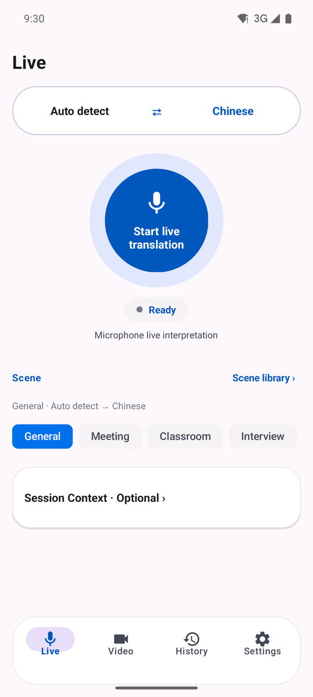
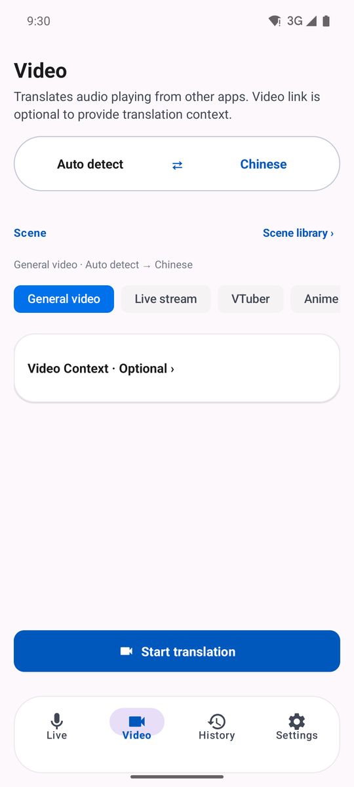
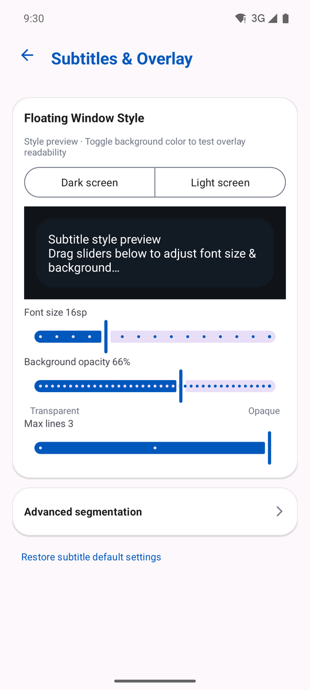
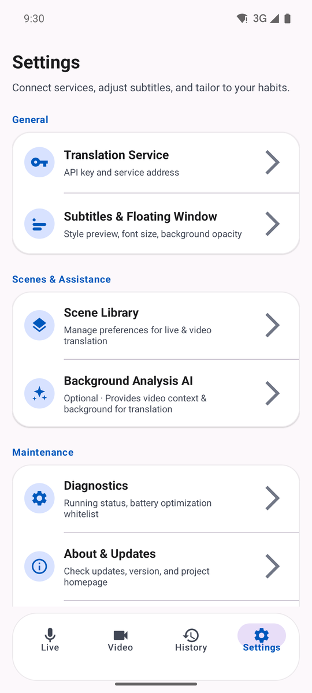

<div align="center">

# LiveTranslate

**Real-time translation for Android**
Microphone interpretation · In-app audio capture · System overlay subtitles

[](https://github.com/xieyuanqing/vtuber-live-translate/actions/workflows/android-debug.yml)
[](LICENSE)


[简体中文](README.md) · [Download APK](https://github.com/xieyuanqing/vtuber-live-translate/releases/latest) · [Docs](docs/README.md)

</div>

---

Translate live speech from the microphone, or capture the audio a video or stream is playing on your phone, and read the result inside the app or in a system overlay.

The goal is **low-latency comprehension support**, not broadcast-quality subtitling. It runs fully local by default: bring your own API key, no backend, no account, no subscription.

> Builds are distributed as GitHub Releases (debug-signed), not through app stores. In-app update checking is included.

## Screens

| Live | Video | Subtitles & Overlay | Settings |
|:---:|:---:|:---:|:---:|
|  |  |  |  |

## Features

| | |
|---|---|
| **Live interpretation** | Meetings, lectures, interviews, travel conversations |
| **Video subtitles** | Captures in-app playback audio via MediaProjection + AudioPlaybackCapture |
| **Mode isolation** | Live and Video keep separate language directions, scenes and session context |
| **Unified scene library** | A scene is a name + a prompt, and it is the only long-lived configuration; create, edit, use, set as default or restore templates per mode |
| **Background analysis AI** | Optional. YouTube / Bilibili / Twitch use dedicated metadata endpoints; other public pages go through Jina Reader. Results land in a preview first and are only applied once you confirm |
| **Real-time subtitles** | In-app subtitle stream plus a draggable, pausable overlay that can collapse to the screen edge |
| **Structured history** | Sessions store language, scene, duration, source and translation, with search, filtering and Markdown copy |
| **Local secure storage** | API keys are encrypted with the Android Keystore; history stays in the app's private directory |
| **Bilingual UI** | Follow system / Simplified Chinese / English — **the UI language never changes the prompt sent to the model** |

### Configuration boundaries

UI language, translation direction and scenes are three independent things, and tests lock that boundary:

- The **scene library** is the only long-lived configuration: reusable scene names and prompts.
- **Language direction** belongs to no scene entry. It is stored per mode and adjustable at any time; switching scenes never changes it.
- **Session context** lives only on the Live or Video home screen and is never written into the scene library.
- Starting a session **freezes** the full prompt and scene name. Permission callbacks, reconnects and the foreground service never re-read configuration you are still editing.

## How it works

```text
Microphone AudioRecord ───────────┐
                                  ├─→ PCM16 / 16 kHz / mono / 100 ms
App audio AudioPlaybackCapture ───┘
                                      ↓
                            Gemini Live Translate
                                      ↓
                              SubtitleStabilizer
                         ┌────────────┼────────────┐
                         ↓            ↓            ↓
                   In-app stream   Overlay    Structured history
```

The real-time pipeline runs inside the `CaptureService` foreground service:

- `PcmProcessor` — resampling and chunking
- `GeminiLiveClient` — WebSocket, audio queue, proactive rotation and reconnection
- `SubtitleStabilizer` — streaming segmentation, deduplication and confirmed lines
- `StatusBus` — read-only session state snapshot for the UI
- `SubtitleOverlay` / `TranscriptLogger` — overlay rendering and local history

Background analysis AI is a separate path and never touches the real-time audio connection.

## Getting started

### Install

Grab the APK from [Releases](https://github.com/xieyuanqing/vtuber-live-translate/releases/latest), or build it yourself:

```bash
git clone https://github.com/xieyuanqing/vtuber-live-translate.git
cd vtuber-live-translate/android
./gradlew :app:testDebugUnitTest :app:lintDebug :app:assembleDebug
adb install -r app/build/outputs/apk/debug/app-debug.apk
```

Requires JDK 17 and Android SDK 35. The `android/app/debug.keystore` in this repository is a fixed public debug key so local and CI artifacts can replace each other on install — it is **not** a release signing key.

### First run

1. Open **Settings → Translation Service** and enter a Gemini API key (separate multiple keys with commas). Use *Custom service address* if you go through a proxy.
2. Pick source language, target language and a scene on the Live or Video home screen. Edit prompts in the scene library when needed.
3. Grant microphone permission for Live; Video additionally needs overlay permission and a MediaProjection prompt on every start.
4. Once a session starts the page switches to a subtitle-focused running state, and returns to configuration when you stop.

Background analysis AI is configured separately under **Settings → Background Analysis AI** and does not share the real-time connection state.

## Requirements

- Android 10 (API 29) or newer
- Network access to a Gemini Live Translate endpoint
- At least one valid API key

Video subtitles have two additional system constraints:

- The target app must allow AudioPlaybackCapture. DRM playback, calls and apps that explicitly opt out cannot be captured.
- Video mode needs the system overlay permission plus a MediaProjection confirmation each time capture starts.

## Data and privacy

- API keys are encrypted with Android Keystore AES-GCM before being stored in local SharedPreferences.
- Session history is stored as structured JSON in the app-private `history_v2` directory and is never copied to public Downloads automatically.
- Audio is sent to your configured endpoint only while a translation session is running.
- Session context enters the current session prompt; history keeps only a truncated summary of it.
- When analysing an unknown platform page, the full target URL (including query parameters) is sent to the third-party Jina Reader. Known YouTube, Bilibili and Twitch links never use that service. Generic fetching rejects single-label/intranet hosts, local/private/reserved addresses, URLs carrying credentials and non-standard ports, and checks every resolved A/AAAA record before sending.
- No account system, ad SDK or analytics SDK.

When you point the app at a custom base URL or a third-party analysis service, data handling is governed by that provider — evaluate it yourself.

<details>
<summary><b>Permissions</b></summary>

| Permission | Purpose |
|---|---|
| `INTERNET` | Reaching the translation and analysis endpoints |
| `RECORD_AUDIO` | Microphone interpretation and AudioPlaybackCapture |
| `SYSTEM_ALERT_WINDOW` | Overlay subtitles; required for video mode |
| `FOREGROUND_SERVICE_*` | Keeping the audio pipeline alive during a session |
| `POST_NOTIFICATIONS` | Foreground service notification on Android 13+; denying it does not block the pipeline |
| `WAKE_LOCK` | Reduces the chance of long sessions being interrupted by sleep |
| `REQUEST_IGNORE_BATTERY_OPTIMIZATIONS` | Optional entry point for background survival settings |

</details>

<details>
<summary><b>Tech stack and project layout</b></summary>

- Kotlin 2.0.21 · Android XML Views + Material 3
- Gradle 8.9 / AGP 8.7.3 · Java 17
- OkHttp WebSocket · JUnit 4 + Robolectric
- minSdk 29 / compileSdk 35 / targetSdk 35

```text
.
├── android/                         # Android Studio / Gradle project
│   └── app/src/
│       ├── main/java/.../           # Kotlin sources
│       ├── main/res/                # Layouts, themes and drawables
│       └── test/java/.../           # JVM / Robolectric regression tests
├── docs/                            # Roadmap, tech notes, dev log, screenshots
├── .github/workflows/               # Unit tests, lint and debug build
├── CLAUDE.md                        # Brief for AI-assisted development
└── README.md
```

</details>

## Documentation

Full index in [docs/README.md](docs/README.md). Most of it is written in Chinese. Frequently used entries:

- [Roadmap](docs/01-roadmap.md) · [Tech notes](docs/02-tech-notes.md) · [Android primer](docs/03-android-primer.md)
- [Dev log](docs/04-dev-log.md) — the reason and the real verification result behind every change
- [UI declutter plan](docs/08-ui-declutter-plan.md)

## Continuous integration

[`.github/workflows/android-debug.yml`](.github/workflows/android-debug.yml) **does not run on push or pull requests**; local verification is the source of truth. Trigger it manually (`workflow_dispatch`) when you need a remote APK artifact or an independent check. It validates the Gradle wrapper, sets up JDK 17 and the Android SDK, runs `:app:testDebugUnitTest :app:lintDebug :app:assembleDebug`, and uploads the debug APK.

## Current status

Current version **v2.6.0 (versionCode 38)**.

This release is about quieting the interface down:

- **One skeleton for both service pages** — Translation Service and Background Analysis AI now share the same structure (inputs → a small self-test button → collapsible rows for optional settings), with buttons split into three weight tiers instead of a screenful of equally loud blocks.
- **In-place model dropdown** — a refresh icon sits next to the model field; tapping it fetches the list and expands a dropdown right there, replacing the old full-screen picker panel.
- **Slimmer overlay** — control buttons went from 44dp to 28dp, and collapsing now leaves a thin blue bar hugging the screen edge (10dp visible, 28dp touch target, the difference rendered as a halo fading inward).
- **Fixed the control bar that never auto-hid** — the old implementation scheduled the hide inside a refresh callback that fires on every subtitle line, so the countdown was reset forever. Controls are now toggled by tapping a blank area of the panel.

See the [dev log](docs/04-dev-log.md) for the full change and verification record.

## Known limitations

- Gemini Live Translate uses a preview model; names, regions and quotas can change upstream.
- Real-time output is meant for quick comprehension, not complete, verbatim or publishable subtitles.
- Vendor background policies, overlay policies and the target app's capture policy all affect the experience.
- Builds are debug-signed. Update checking is supported; silent installs, account sync and cross-device history sync are not.
- Not fully tested for accessibility, tablets, landscape or every vendor ROM.

## Contributing

This is a personal project, but reproducible issues and concrete suggestions are welcome. When submitting changes:

- write comments, docs and commit messages in Chinese;
- keep Live and Video configuration strictly isolated;
- never write session context into the scene library;
- update [`docs/04-dev-log.md`](docs/04-dev-log.md);
- pass unit tests, lint and the debug APK build at minimum.

More constraints in [CLAUDE.md](CLAUDE.md).

## License

[MIT](LICENSE) © 2026 xieyuanqing
