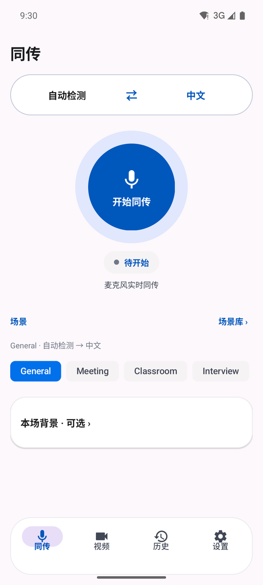
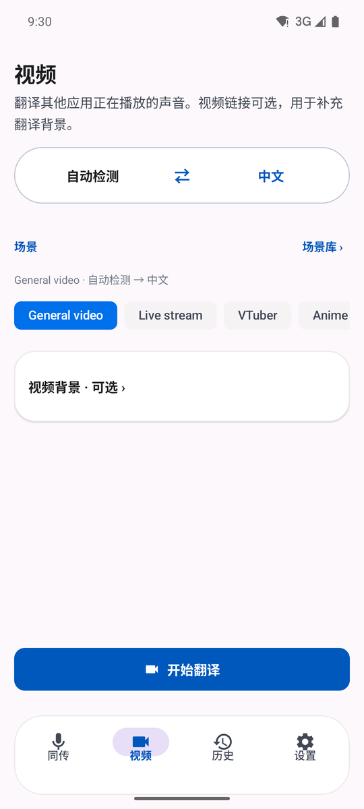
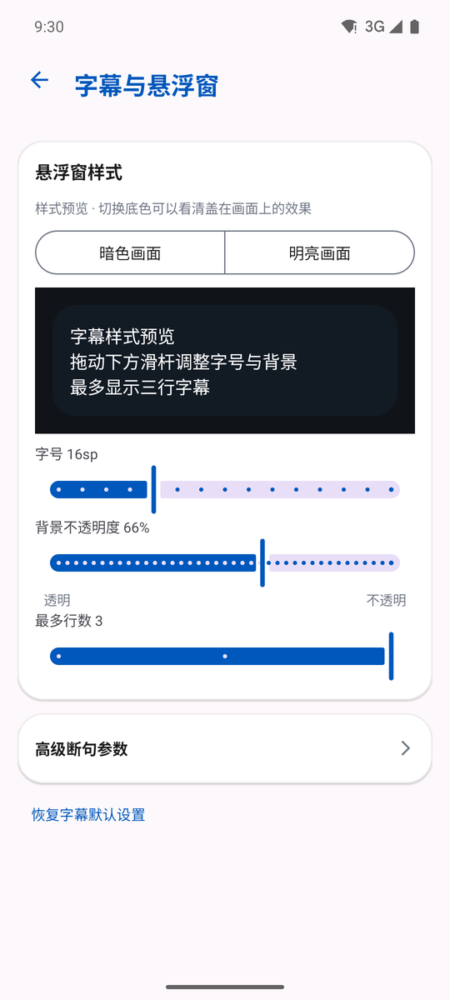
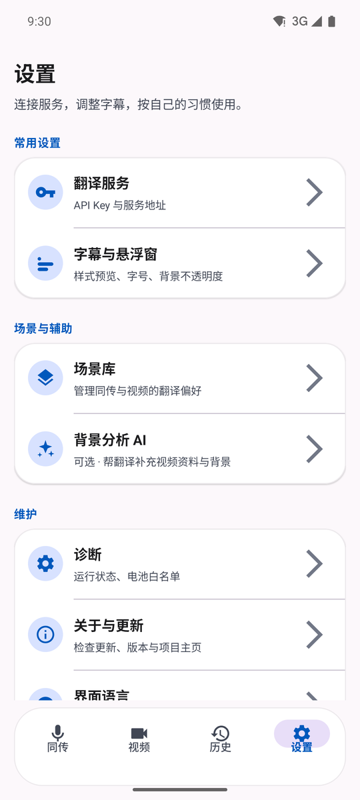

<div align="center">

# 流译 LiveTranslate

**Android 实时翻译工具**
麦克风同传 · 应用内音频捕获 · 系统悬浮字幕

[](https://github.com/xieyuanqing/vtuber-live-translate/actions/workflows/android-debug.yml)
[](LICENSE)


[English](README.en.md) · [下载 APK](https://github.com/xieyuanqing/vtuber-live-translate/releases/latest) · [文档索引](docs/README.md)

</div>

---

既可以通过麦克风进行现场同传，也可以捕获手机里正在播放的视频或直播音频，把译文显示在 App 内或系统悬浮窗上。

目标是**低延迟的理解辅助**，而不是发布级字幕制作。默认运行形态是纯本地：填自己的 API Key，不需要任何后端、账号或订阅。

> 目前提供 GitHub Release 内测包（Debug 签名），不做商店分发，App 内支持检查更新。

## 界面

| 同传 | 视频 | 字幕与悬浮窗 | 设置 |
|:---:|:---:|:---:|:---:|
|  |  |  |  |

## 功能

| | |
|---|---|
| **麦克风同传** | 会议、课堂、采访、旅行交流等现场场景 |
| **视频字幕** | 通过 MediaProjection + AudioPlaybackCapture 捕获应用内播放的音频 |
| **模式隔离** | 同传与视频各自维护语言方向、场景和本场上下文，互不覆盖 |
| **统一场景库** | 场景 = 名称 + 提示词，是唯一的长期配置；可按模式新建、编辑、使用、设为默认或恢复模板 |
| **背景分析 AI** | 可选。YouTube / 哔哩哔哩 / Twitch 走专用元数据接口，其他公网播放页经 Jina Reader 提取文本；结果先进预览，确认后才写入 |
| **实时字幕** | App 内字幕流 + 可拖动、可暂停、可收进屏幕侧边的系统悬浮字幕 |
| **结构化历史** | 按会话保存语言、场景、时长、原文与译文，支持搜索、筛选、Markdown 复制 |
| **本地安全存储** | API Key 经 Android Keystore 加密，历史保存在 App 私有目录 |
| **双语界面** | 跟随系统 / 简体中文 / English；**界面语言不改变发给模型的提示词** |

### 配置边界

界面语言、翻译方向和场景是三件独立的事，这条边界由测试锁定：

- **场景库**是唯一的长期配置，保存可复用的场景名称与提示词。
- **语言方向**不属于任何场景条目，按模式独立保存、随时可调；切换场景不改变语言。
- **本场上下文**只存在于同传或视频主页，不写入场景库。
- 会话启动时**冻结**完整 Prompt 与场景名称；权限回调、重连和后台服务不会重新读取正在编辑的配置。

## 工作原理

```text
麦克风 AudioRecord ───────────────┐
                                  ├─→ PCM16 / 16 kHz / mono / 100 ms
应用音频 AudioPlaybackCapture ────┘
                                      ↓
                            Gemini Live Translate
                                      ↓
                              SubtitleStabilizer
                         ┌────────────┼────────────┐
                         ↓            ↓            ↓
                    App 字幕流    系统悬浮字幕   结构化历史
```

实时管线跑在前台服务 `CaptureService` 里：

- `PcmProcessor` — 音频重采样与分块
- `GeminiLiveClient` — WebSocket、音频队列、主动轮换与断线重连
- `SubtitleStabilizer` — 流式字幕切句、去重与确认行处理
- `StatusBus` — 向界面提供只读的会话状态快照
- `SubtitleOverlay` / `TranscriptLogger` — 悬浮显示与本地历史

背景分析 AI 是独立链路，不参与实时音频连接。

## 快速开始

### 安装

从 [Releases](https://github.com/xieyuanqing/vtuber-live-translate/releases/latest) 下载 APK，或自行构建：

```bash
git clone https://github.com/xieyuanqing/vtuber-live-translate.git
cd vtuber-live-translate/android
./gradlew :app:testDebugUnitTest :app:lintDebug :app:assembleDebug
adb install -r app/build/outputs/apk/debug/app-debug.apk
```

需要 JDK 17 与 Android SDK 35。仓库内的 `android/app/debug.keystore` 是固定的公开 Debug 签名，只为让本地与 CI 产物能互相覆盖安装，**不是正式发布密钥**。

### 首次配置

1. **设置 → 翻译服务**，填写 Gemini API Key（多个 Key 用英文逗号分隔）。需要反代时在「自定义服务地址」里改 Base URL。
2. 在同传或视频主页选择源语言、目标语言和场景；需要改提示词就进场景库编辑。
3. 同传模式授予录音权限；视频模式额外需要悬浮窗权限和每次开始时的屏幕捕获授权。
4. 开始会话后页面切到专注字幕的运行态，停止后回到配置界面。

背景分析 AI 在 **设置 → 背景分析 AI** 单独配置，不复用实时翻译的连接状态。

## 环境要求

- Android 10（API 29）或更高版本
- 可访问 Gemini Live Translate 服务的网络
- 至少一个有效 API Key

视频字幕另有两个系统限制：

- 目标应用必须允许 AudioPlaybackCapture；部分 DRM、通话或主动禁止捕获的应用无法内录。
- 视频模式需要系统悬浮窗权限，且每次开始捕获都要确认 MediaProjection 授权。

## 数据与隐私

- API Key 经 Android Keystore AES-GCM 加密后存入本地 SharedPreferences。
- 会话历史以结构化 JSON 保存在 App 私有目录 `history_v2`，不会自动复制到公共 Downloads。
- 音频只在翻译会话运行期间发送到用户配置的实时翻译端点。
- 本场上下文会进入当前会话提示词；历史只保存截断后的上下文摘要。
- 解析未知平台页面时，完整目标 URL（含 query）会发送给第三方 Jina Reader；已知的 YouTube、哔哩哔哩和 Twitch 链接不走该服务。通用抓取会拒绝单标签/内网域名、本地/私网/保留地址、带凭据 URL 和非标准端口，并在发送前检查域名的全部 A/AAAA 解析结果。
- 不含账号系统、广告 SDK 或分析 SDK。

使用自定义 Base URL 或第三方分析服务时，数据处理规则取决于对应服务提供方，请自行评估。

<details>
<summary><b>权限说明</b></summary>

| 权限 | 用途 |
|---|---|
| `INTERNET` | 连接实时翻译与背景分析接口 |
| `RECORD_AUDIO` | 麦克风同传和 AudioPlaybackCapture |
| `SYSTEM_ALERT_WINDOW` | 系统悬浮字幕；视频模式必须启用 |
| `FOREGROUND_SERVICE_*` | 会话期间保持音频管线运行 |
| `POST_NOTIFICATIONS` | Android 13+ 显示前台服务通知；拒绝不影响核心管线 |
| `WAKE_LOCK` | 降低长会话被休眠打断的概率 |
| `REQUEST_IGNORE_BATTERY_OPTIMIZATIONS` | 可选的后台存活设置入口 |

</details>

<details>
<summary><b>技术栈与项目结构</b></summary>

- Kotlin 2.0.21 · Android XML Views + Material 3
- Gradle 8.9 / AGP 8.7.3 · Java 17
- OkHttp WebSocket · JUnit 4 + Robolectric
- minSdk 29 / compileSdk 35 / targetSdk 35

```text
.
├── android/                         # Android Studio / Gradle 项目
│   └── app/src/
│       ├── main/java/.../           # Kotlin 业务代码
│       ├── main/res/                # XML 布局、主题与图形资源
│       └── test/java/.../           # JVM / Robolectric 回归测试
├── docs/                            # 路线图、技术记录、开发日志与截图
├── .github/workflows/               # 单元测试、Lint 与 Debug 构建
├── CLAUDE.md                        # AI 辅助开发速览
└── README.md
```

</details>

## 文档

完整索引见 [docs/README.md](docs/README.md)。常用入口：

- [开发路线图](docs/01-roadmap.md) · [技术记录](docs/02-tech-notes.md) · [Android 项目入门](docs/03-android-primer.md)
- [开发日志](docs/04-dev-log.md) — 每次改动的原因与真实验证结果
- [UI 去噪与信息架构方案](docs/08-ui-declutter-plan.md)

## 持续集成

[`.github/workflows/android-debug.yml`](.github/workflows/android-debug.yml) **不随 push / PR 自动运行**；交付以本地验证为准。需要远端 APK artifact 或独立复核时在 Actions 页手动触发（`workflow_dispatch`），流程为：校验 Gradle Wrapper → 配置 JDK 17 与 Android SDK → `:app:testDebugUnitTest :app:lintDebug :app:assembleDebug` → 上传 Debug APK。

## 当前状态

当前版本 **v2.6.0（versionCode 38）**。

本版的重点是把界面收干净：

- **设置页统一骨架** — 翻译服务与背景分析 AI 两页压成同一套结构（输入 → 小按钮自检 → 折叠行承载可选项），按钮按主次分三层，不再是一屏同权重色块。
- **模型选择就地下拉** — 模型输入框右侧一个刷新图标，点一下拉取并原地展开选择，取代原来的全屏选择面板。
- **悬浮窗瘦身** — 控制按钮 44dp → 28dp，收起后只留一根贴边小蓝条（视觉 10dp，触摸区 28dp，多出的部分做成朝屏幕内侧的半透明晕）。
- **修掉控制条自动隐藏失效** — 旧实现把定时隐藏排在每条字幕都会调用的刷新函数里，倒计时被无限重置；现在改成点面板空白处手动切换。

详细变更与验证记录见 [开发日志](docs/04-dev-log.md)。

## 已知限制

- Gemini Live Translate 使用预览模型，模型名称、可用区域和配额可能由上游调整。
- 实时输出适合快速理解，不保证完整、逐字或可直接发布的字幕质量。
- 厂商后台策略、悬浮窗策略和目标应用的内录策略都可能影响体验。
- 当前是 Debug 签名内测包；支持检查更新，不提供静默安装、账号同步或跨设备历史同步。
- 未针对无障碍、平板、横屏和所有厂商 ROM 做完整测试。

## 参与开发

这是个人自用项目，但欢迎通过 Issue 提交可复现的问题或明确的建议。提交改动时请：

- 使用中文注释、文档和提交说明；
- 保持同传与视频配置严格隔离；
- 不把本场临时上下文写入场景库；
- 更新 [`docs/04-dev-log.md`](docs/04-dev-log.md)；
- 至少通过单元测试、Lint 和 Debug APK 构建。

更多约束见 [CLAUDE.md](CLAUDE.md)。

## 许可证

[MIT](LICENSE) © 2026 xieyuanqing
